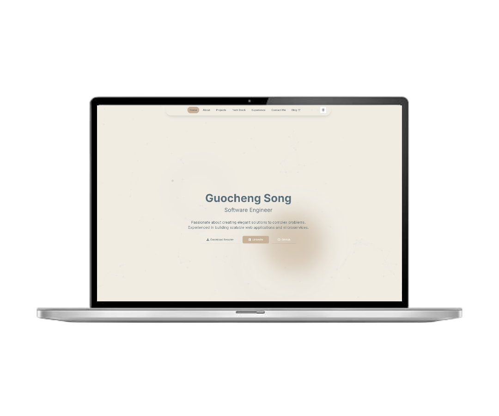

# Modern Personal Website Template



## 🌟 Overview

This is a sleek, responsive personal website template built with modern web technologies. It features a clean, minimalist design with a Morandi color scheme, creating a professional and aesthetically pleasing online presence.

## 🎨 Features

- **Responsive Design**: Looks great on desktop, tablet, and mobile devices
- **Dark/Light Mode**: Toggle between dark and light themes
- **Smooth Animations**: Utilizes Framer Motion for smooth, engaging animations
- **Interactive Sections**: 
  - Home
  - About
  - Projects
  - Experience (Timeline)
  - Tech Stack
  - Contact Form

## 🛠 Tech Stack

<div align="center">

[](https://nextjs.org/)
[](https://reactjs.org/)
[](https://www.typescriptlang.org/)
[](https://tailwindcss.com/)
[](https://www.framer.com/motion/)
[](https://ui.shadcn.com/)
[](https://lucide.dev/)

</div>

- **Framework**: Next.js (React)
- **Styling**: Tailwind CSS
- **Animations**: Framer Motion
- **Icons**: Lucide React
- **UI Components**: Custom components built with shadcn/ui
- **Theming**: next-themes
- **Type Checking**: TypeScript


## 🚀 Getting Started

1. Clone the repository:
```

git clone [https://github.com/yourusername/personal-website.git](https://github.com/yourusername/personal-website.git)

```

2. Install dependencies:
```

cd personal-website
npm install

```

3. Run the development server:
```

npm run dev

```

4. Open [http://localhost:3000](http://localhost:3000) in your browser to see the result.

## 🎨 Customization

- Update the content in each component file to reflect your personal information.
- Modify the Morandi color scheme in `tailwind.config.js` to match your preferences.
- Add or remove sections by editing the `src/app/page.tsx` file.

## 📄 License

This project is open source and available under the [MIT License](LICENSE).

## 🤝 Contributing

Contributions, issues, and feature requests are welcome! Feel free to check [issues page](https://github.com/yourusername/personal-website/issues).

## 👨‍💻 Author

Guocheng Song
- GitHub: [@feichai0017](https://github.com/feichai0017)
- LinkedIn: [Guocheng Song](www.linkedin.com/in/guocheng-song-728580318)

## 🙏 Acknowledgments

- [Next.js Documentation](https://nextjs.org/docs)
- [Tailwind CSS](https://tailwindcss.com/)
- [Framer Motion](https://www.framer.com/motion/)
- [shadcn/ui](https://ui.shadcn.com/)

---
